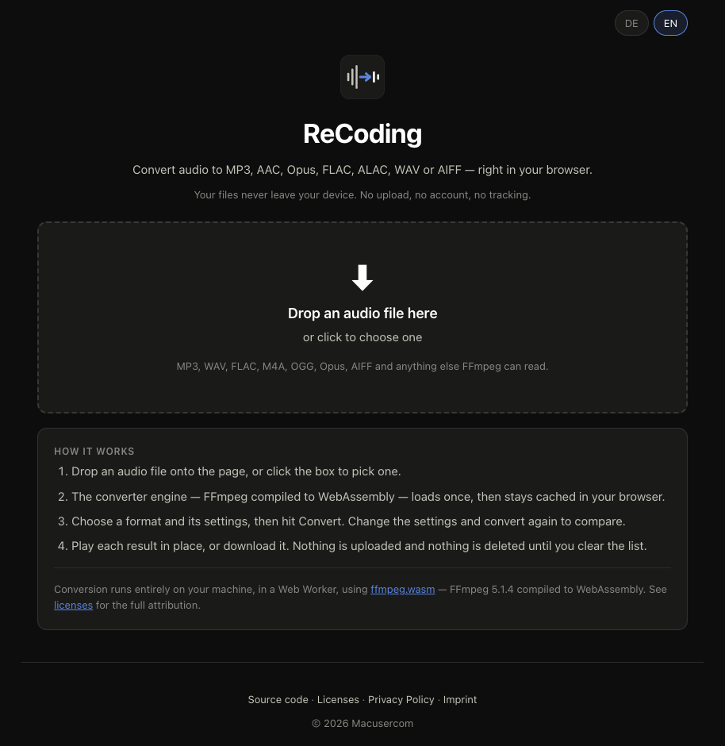

# ReCoding – Audio Converter (Web)
A privacy-first web app that converts audio to MP3, AAC, Opus, FLAC, ALAC, WAV or AIFF. Pick a file, choose a codec and its settings, and convert it as many times as you like — every version is kept side by side so you can play them, compare their size and download the one you want. Everything runs locally in your browser: no upload, no account, no tracking.

🌐 **[Try it live → macusercom.github.io/recoding](https://macusercom.github.io/recoding/)**


## Images

<p align="center">
  <br>
  <sub><b>Start</b> — drop a file and pick a format</sub>
</p>

<!-- Room for more: add images/image2.png (output settings) and images/image3.png
     (converted files side by side) and lay the three out in a table when they exist. -->


## Features
- Drag & drop an audio file anywhere on the page, or click to pick one
- Reads the real format out of the file — codec, sample rate, channels, bit depth, bitrate and duration — rather than trusting the extension
- **MP3** (libmp3lame): CBR, ABR or VBR (V0–V9), 8–320 kbps, 8–48 kHz, joint stereo switch, bit reservoir
- **AAC-LC**: 8–320 kbps, 7.35–96 kHz, forced M/S stereo, two-loop or fast coder — the offered range narrows to what FFmpeg's AAC encoder really delivers at the chosen rate and channel count. At 44.1 kHz stereo the steps above 224 kbps stay available even though they arrive short (320 comes out near 250 on music)
- **Opus** (libopus): 6–512 kbps, VBR / constrained VBR / CBR, speech or music tuning, encoding effort 0–10
- **FLAC**: lossless, compression level 0–12, 16- or 24-bit, mid/side or independent stereo
- **ALAC**: lossless, 16- or 24-bit, in an MP4 container Apple software plays natively
- **WAV** and **AIFF**: uncompressed PCM, 8/16/24/32-bit and 32-bit float, any sample rate
- Only valid combinations are offered — the bitrate list follows the sample rate and channel count, because the legal range does too. Every offered value was checked against the shipped encoder: MPEG-2.5 MP3 stops at 64 kbps, and FFmpeg's AAC encoder quietly rewrites anything outside a window that moves with both
- The bitrate is the rate of the whole file, not of one channel, so mono at a given number gives each channel twice what stereo does — the field says so
- Options a codec genuinely cannot do are disabled and say why, instead of silently doing something else
- Convert the same file over and over: results accumulate, nothing is overwritten
- Every result shows the exact settings it was made with, the bitrate it actually came out at, its size against the source, a player and a download link — the actual bitrate is highlighted when the encoder missed a set target by more than 6 %
- The exact FFmpeg command is shown per result, so nothing about the conversion is a black box
- Queue several conversions while one is running; remove one result or clear them all
- Formats the browser cannot play fall back to a download link and a note, never a dead player — including a stream whose container the browser accepts but whose bit depth it cannot decode
- Only one file plays at a time: starting a player pauses every other one, so two encodes can never overlap
- A docked bar at the bottom of the window keeps both the conversion progress and the current track in view, however far you scroll — with play/pause, elapsed time and a seek bar
- Encoder-level knobs (MP3 bit reservoir, AAC coding algorithm, Opus encoding effort) sit behind an **Advanced options** disclosure, so the main form stays the six settings that matter
- German and English UI, follows your browser language
- No audio or data ever leaves your machine

Conversion runs in a Web Worker using [ffmpeg.wasm](https://github.com/ffmpegwasm/ffmpeg.wasm) — FFmpeg 5.1.4 compiled to WebAssembly. The engine is served from this repository, so the page makes no third-party requests at all.


## How To Use
1. Open **[macusercom.github.io/recoding](https://macusercom.github.io/recoding/)** in your browser
2. Drop an audio file onto the page, or click the box to choose one
3. Wait once while the converter engine loads — about 32 MB, then cached by your browser
4. Pick a format and its settings, then hit **Convert**
5. Play the result in place or download it. Change the settings, convert again, and compare

No install required. Works on desktop and mobile.


## A note on HE-AAC

ReCoding offers **AAC-LC only**. HE-AAC and HE-AAC v2 require the `libfdk_aac` encoder, which FFmpeg can only be built against with `--enable-nonfree` — and the resulting binary may not be redistributed, so it cannot ship in a web app. FFmpeg's own AAC encoder is LC-only.

Opus is the better choice at the low bitrates HE-AAC was designed for, and it is fully supported here.


## Run Locally

The app uses ES modules and a Web Worker, so opening `index.html` as `file://` will not work — it needs a local server.

```
git clone https://github.com/Macusercom/recoding.git
cd recoding/docs
python3 -m http.server
```

Then open [http://localhost:8000](http://localhost:8000) in your browser.


## Tech
- Vanilla HTML, CSS, JavaScript — no framework, no build step, no package manager
- Encoding via [ffmpeg.wasm](https://github.com/ffmpegwasm/ffmpeg.wasm) 0.12.15 with the single-threaded `@ffmpeg/core` 0.12.10, vendored into `docs/vendor/`
- Single-threaded on purpose: the multi-threaded core needs `SharedArrayBuffer`, which needs COOP/COEP response headers, which GitHub Pages cannot set
- The input file is mounted read-only via WORKERFS rather than copied into the wasm heap, so a large file does not have to fit in memory twice
- `docs/codecs.js` is the single source of truth: the settings form is rendered from the same tables that build the FFmpeg arguments
- Settings and language are kept in `localStorage` — no cookies


## License

ReCoding is licensed under the **GNU General Public License v3.0 or later** — see [LICENSE](LICENSE).

It bundles `ffmpeg-core.wasm`, a build of FFmpeg n5.1.4 that is itself under the **GPL-2.0-or-later** (it is compiled with `--enable-gpl`), which is why ReCoding is conveyed under the GPL rather than a permissive license. The ffmpeg.wasm JavaScript wrapper is MIT, © 2019 Jerome Wu.

Full attribution, license texts and the corresponding-source links are in
[THIRD-PARTY-LICENSES.md](THIRD-PARTY-LICENSES.md) and on the site's own
[licenses page](docs/licenses.html).
